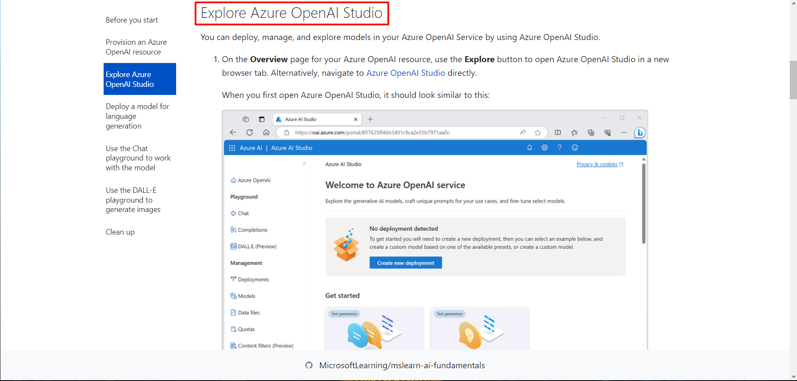
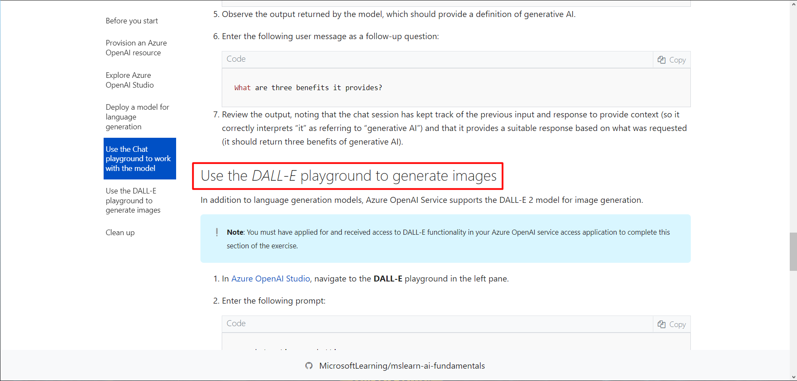
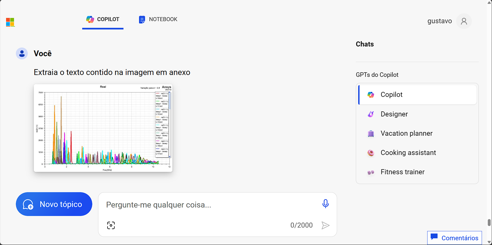
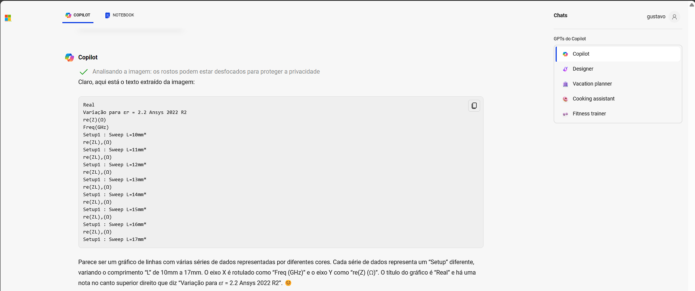
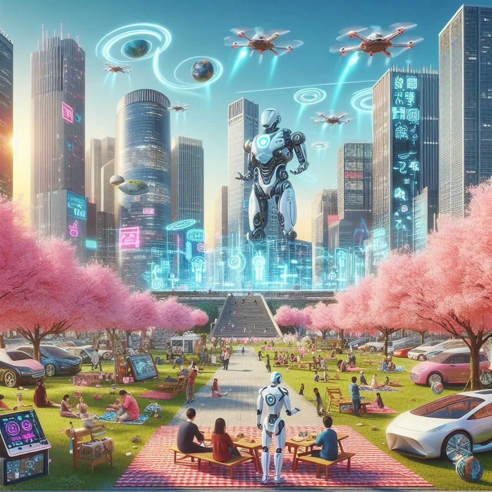
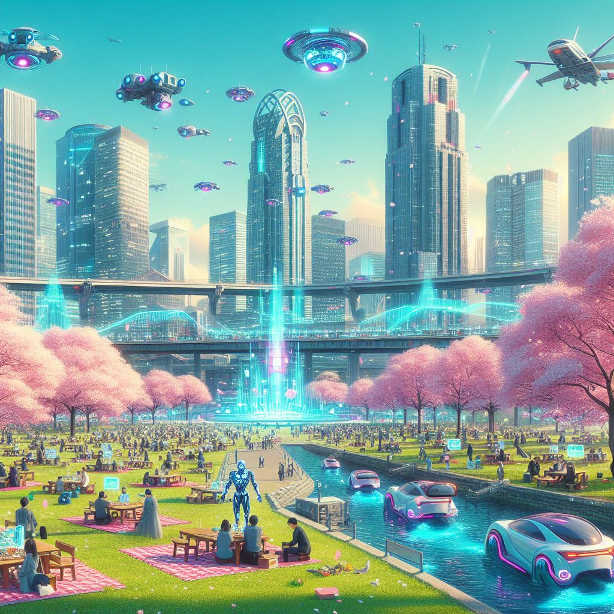

  

## Descrição do Projeto 📚

Este projeto utiliza uma plataforma de IA Generettiva para auxiliar numa tarefa específica.

## Conjunto de Dados 💾

O conjunto de dados utilizado neste projeto consiste de uma imagem a qual será cedida ao **Copilot** para extrair o texto desta imagem utilizando apenas um **prompt**.

## Metodologia 📘

O projeto inical se trata de utilizar a ferramenta do *OpenAI* no Azure para performar tais tarefas. Entretanto, é necessário a aplicação a parte no [Link da aplicação do OpenAI](https://customervoice.microsoft.com/Pages/ResponsePage.aspx?id=v4j5cvGGr0GRqy180BHbR7en2Ais5pxKtso_Pz4b1_xUNTZBNzRKNlVQSFhZMU9aV09EVzYxWFdORCQlQCN0PWcu) para que isso seja possível.

O guia do lab que está presente nesse [Link](https://microsoftlearning.github.io/mslearn-ai-fundamentals/Instructions/Labs/13-azure-openai.html) basicamente faz a instrução de 2 atividades diferentes, sendo uma delas prompt normal para a LLM:

  

E também um prompt para o modelo de imagens do OpenAI, o DALL-E.

  

Como o acesso dessas ferramentas dentro do Azure demandam análise da Microsoft e ainda demandam um email corporativo para que a ferramenta seja liberada, foi optado por usar o Copilot presente no próprio Windows 11.

  

Na primeira etapa, foi feito o *upload* de uma imagem para o **Copilot** e pedido para transcrever o texto da imagem:.

  

O **Copilot** conseguiu transcrever todo o texto de uma imagem, que se tratava de um *plot* gráfico, quase perfeitamente como visto na imagem de saída:

  

A outra atividade foi pedir para o **Copilot** gerar uma imagem a partir de um prompt. Foi passado o seguinte pedido:

"Imagine a imagem de como seria a cidade de Tokio daqui 100 anos"

O resultado retornado pelo **Copilot** foram as duas imagens a seguir:

  

  

Essas foram apenas 2 de diversas tarefas possíveis utilizando os assistentes virtuais baseados em LLM's. Esses assistentes podem tornar um trabalho de desenvolver algum código ou pensar alguma coisa muito mais fácil, entretanto, é necessário avaliar bem os resultados e considerar adaptações, principalmente em códigos gerados por esses assistentes.

## Repositório do Projeto 🗂️

## Conclusão 🔚

Com esse projeto, foi possível explorar a IA Generativa e obter resultados muito satisfatórios acerca do *prompt* inicial. Na garande parte dos casos, principalmente se tratando de auxílio em programação e ferramentas de extração de texto em imagens, é necessário pouca ou nenhuma modificação para que tudo funcione.
